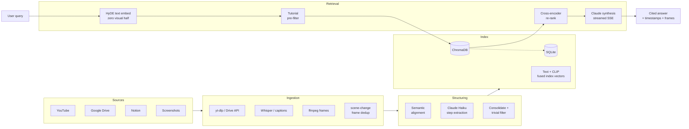

<div align="center">

# Stepwise

### Turn tutorial videos into a knowledge base that answers questions with the exact step — and the screenshot to prove it.

Stepwise ingests YouTube videos, Google Drive recordings, Notion docs, and screenshots, then uses Claude to decompose them into structured, timestamped, **visually-grounded steps**. Ask a question in plain English and get a cited answer that links back to the precise moment in the source video.

<br/>


</div>

---

## The problem

Support and onboarding knowledge is trapped in **video**. A 30-minute screencast might contain the one answer a user needs at the 14:32 mark — but nobody can search it, cite it, or surface it inside a support ticket. Transcripts alone aren't enough: half the information in a UI tutorial is *on the screen*, not in the narration ("click **here**, then toggle **this**").

**Stepwise makes video as searchable as documentation** — without throwing away the visual half of the signal.

```
┌─────────────┐    ┌──────────────┐    ┌─────────────┐    ┌──────────────┐
│   YouTube    │    │  Transcript   │    │   Claude     │    │  "How do I    │
│   Drive      │ →  │  + Frames     │ →  │  structures  │ →  │   issue a     │
│   Notion     │    │  (multimodal) │    │  into steps  │    │   refund?"    │
│   Screenshots│    │               │    │              │    │   ↳ Step 4 @  │
└─────────────┘    └──────────────┘    └─────────────┘    │     2:14 📸   │
                                                            └──────────────┘
```

---

## What makes it interesting

| | |
|---|---|
| 🎥 **Multimodal structuring** | Claude reads transcript + screenshots at ingest time. Steps are indexed as fused **text + CLIP-image** vectors (896-dim); retrieval is **text-first** over visually enriched descriptions. |
| 🧠 **HyDE retrieval** | Embeds a hypothetical *answer* instead of the question — closing the question↔instruction vocabulary gap. ([deep dive →](docs/hyde.md)) |
| 🔁 **Auto-ingestion** | Watch a YouTube channel, Drive folder, or Notion database. New content is detected and ingested automatically — reactive becomes proactive. |
| 🔍 **Gap detection** | Clusters queries the library *couldn't* answer well, names each gap with Claude, and suggests exactly what tutorial to record next. |
| 💸 **Cost-engineered** | Haiku for high-volume extraction, scene-change frame dedup, and prompt caching cut the expensive ingestion path by a large margin — without dropping the visual modality. |
| 🎫 **Ships where work happens** | A Zendesk sidebar app surfaces relevant steps on the active ticket and inserts a cited, timestamped link with one click. |

---

## Architecture



---

## The ingestion pipeline

Every source — a YouTube URL, a Drive `.mp4`, a Notion page, a folder of PNGs — is normalised into the **same artifact shape** (`transcript[]` + `frames[]`) and then run through one shared pipeline:

```
download ─→ transcribe ─→ extract frames ─→ dedup frames ─→ align segments
                                                                  │
   index ◄─ filter trivial ◄─ consolidate ◄─ Claude extracts steps
```

1. **Download & transcribe** — captions when available, Whisper fallback when not. Notion skips this entirely (text-first, no video).
2. **Frame extraction** — `ffmpeg` samples a frame every N seconds.
3. **Scene-change dedup** — a 32×32 grayscale diff drops near-identical consecutive frames *before* they ever reach Claude. A presenter talking to camera for 30 seconds collapses from 6 frames to 1.
4. **Semantic alignment** — transcript is chunked on sentence boundaries, with window size that **scales to video length** (fine-grained for shorts, coarse for hour-long talks).
5. **Claude structuring** — each segment (transcript + up to 2 frames) becomes typed steps via tool-use: `{title, description, action_type, confidence}`. When there's no transcript, Claude reads the steps straight off the screenshots.
6. **Consolidate & filter** — merge fragments toward ~1 step/minute, drop intros, outros, and "like & subscribe" filler.

---

## The retrieval pipeline

```
query ─→ HyDE ─→ text embed (384-d) + zero visual half ─→ tutorial pre-filter ─→ vector search ─→ cross-encoder ─→ dedup ─→ synthesize
        (Haiku)              (896-d fused query vector)      (centroid gate)        (ChromaDB)      (MiniLM rerank)         (Haiku, streamed)
```

- **HyDE** — Claude writes a hypothetical answer-shaped step; *that* gets embedded, not the raw question. Conversation history is included so follow-ups like *"how do I undo that?"* resolve correctly. ([why this works →](docs/hyde.md))
- **Text-first retrieval** — query vectors use HyDE text + a **zero visual half** (no CLIP at query time). Visual context enters search through Claude-extracted step descriptions; screenshots are returned as evidence, not used for image-to-image matching. See [docs/hyde.md](docs/hyde.md) for the full embedding scheme.
- **Tutorial pre-filter** — a per-tutorial **centroid** index gates the search: if one tutorial is clearly relevant, search is scoped to it; otherwise it falls back to the full corpus.
- **Cross-encoder re-rank** — `ms-marco-MiniLM` re-scores the top candidates for precision the bi-encoder can't reach alone.
- **Near-duplicate suppression** — steps ≥85% textually similar collapse to the best-ranked copy.
- **Streaming synthesis** — the answer streams token-by-token over SSE, grounded **only** in retrieved steps, with each step carrying its timestamp and frame.

Every query is logged with full telemetry (latencies, distances, cross-encoder scores) — which is exactly what powers **gap detection**.

---

## 💸 Cost engineering

Ingestion is the expensive path — it's where the multimodal LLM calls happen. Three levers cut that cost hard while **keeping** the visual modality intact:

| Lever | What it does | Why it's free quality |
|---|---|---|
| **Haiku for extraction** | Step extraction is a fixed-schema tool-use task. Haiku does it as well as Sonnet, at roughly an order of magnitude lower cost per token. | Sonnet is reserved for consolidation & answer synthesis, where judgment matters. |
| **Scene-change frame dedup** | Drops near-identical frames before they're encoded as base64 and sent to Claude — often **40–60%** fewer image tokens on screencast content. | Identical frames carry zero new visual information. |
| **Prompt caching** | The structuring system prompt is marked `cache_control: ephemeral` — served from cache on every segment after the first. | Same prompt, every call. Pure win. |

The design principle: **cut tokens, not modalities.** A transcript-only system would be cheaper still — but it would lose half the information in a UI tutorial.

---

## Tech stack

| Layer | Choice |
|---|---|
| **API** | FastAPI · async background jobs · SSE streaming |
| **LLM** | Claude (Haiku for volume, Sonnet for judgment) via tool-use |
| **Embeddings** | `all-MiniLM-L6-v2` (384-dim text) + `clip-ViT-B-32` (512-dim image at index time) → 896-dim fused; queries use text + zero visual half |
| **Vector store** | ChromaDB (steps + tutorial centroids) |
| **Relational** | SQLite via SQLAlchemy (tutorials, steps, jobs, query logs, watchers, feedback) |
| **Re-ranking** | `cross-encoder/ms-marco-MiniLM-L-6-v2` |
| **Media** | yt-dlp · Whisper · ffmpeg · Pillow |
| **Web** | Next.js 16 · React 19 · Tailwind v4 · shadcn |
| **Integrations** | Google Drive API · Notion API · Zendesk App Framework |
| **Deploy** | Docker Compose · Railway |

---

## Quickstart

### Docker (recommended)

```bash
cp .env.example .env          # add your ANTHROPIC_API_KEY
docker compose up --build
```

- API → http://localhost:8000 (`/docs` for interactive OpenAPI)
- Web → http://localhost:3000

### Local

```bash
# Backend
python -m venv venv && source venv/bin/activate
pip install -e .
echo "ANTHROPIC_API_KEY=sk-ant-..." > .env
uvicorn stepwise.api.app:app --reload

# Frontend (separate terminal)
cd web && npm install && npm run dev
```

> **Prerequisites:** `ffmpeg` and `yt-dlp` on your PATH for video ingestion.

### Try it from the CLI

```bash
stepwise ingest "https://www.youtube.com/watch?v=..."
stepwise query "how do I configure an API key?"
```

---

## API reference

| Method | Endpoint | Purpose |
|---|---|---|
| `POST` | `/ingest` | Ingest a YouTube URL |
| `POST` | `/ingest/drive` | Ingest a Google Drive recording |
| `POST` | `/ingest/notion` | Ingest a Notion page (full block-tree parser) |
| `POST` | `/ingest/images` | Ingest screenshots / a ZIP |
| `POST` | `/query` | Ask a question — streamed SSE answer + steps |
| `POST` | `/query/sync` | Same as `/query` but returns JSON `{answer, steps}` (eval, Zendesk) |
| `GET` | `/tutorials` · `/tutorials/{id}` | Browse the library |
| `POST` | `/watchers` · `POST /watchers/poll` | Manage & poll auto-ingestion sources |
| `GET` | `/gaps?force=true` | Detect coverage gaps from query logs |
| `GET` | `/admin/query-logs` · `/admin/stats` | Retrieval telemetry |
| `GET` | `/jobs` · `/jobs/{id}` | Background ingestion job status (with `created_at` / `updated_at` / `completed_at`) |
| `GET` | `/health` | Liveness — always cheap, no dependency checks |
| `GET` | `/ready` | Readiness — verifies DB writability + Chroma reachability (no ML models); `503` when a dependency is down |

Full interactive schema at **`/docs`** when the API is running.

`/health` and `/ready` are the probe endpoints for an orchestrator (Docker healthcheck, Kubernetes liveness/readiness, Railway). Both are exempt from `API_KEY` auth. Use `/health` for liveness (does the process respond) and `/ready` for readiness (can it actually serve traffic) — `/ready` returns a per-check breakdown, e.g. `{"status":"ready","checks":{"db":"ok","chroma":"ok"}}`.

---

## Watch sources & gap detection

The endgame is a system that tells you *what to record next* and ingests it the moment it appears.

```
   ┌──────────────────────────────────────────────────────────┐
   │                                                            │
   │   Users ask questions  ──→  Gap detection clusters the    │
   │                             ones the library can't answer │
   │                                      │                     │
   │                                      ▼                     │
   │   New video appears   ◄──  "Record a tutorial on X"       │
   │   in watched source         (suggested title + search     │
   │        │                     terms surfaced at /gaps)      │
   │        ▼                                                   │
   │   Auto-ingested  ──────────────────→ Gap closed           │
   │                                                            │
   └──────────────────────────────────────────────────────────┘
```

- **Watchers** (`/watchers`) track YouTube channels (via public RSS — no API key), Drive folders (modified-time diff), and Notion databases (last-edited filter). A built-in APScheduler job polls every active source on an interval (default 30 min) and auto-queues anything new — no external cron required. `POST /watchers/poll` triggers an immediate check.
- **Gaps** (`/gaps`) embeds poorly-served queries, clusters them by cosine similarity, and asks Claude to name each gap with a suggested tutorial title and YouTube search terms.

---

## Configuration

Set via `.env` (see [`.env.example`](.env.example)):

| Variable | Default | Description |
|---|---|---|
| `ANTHROPIC_API_KEY` | *(required)* | Claude API key |
| `CLAUDE_MODEL` | `claude-sonnet-4-6` | Model for consolidation & synthesis |
| `STRUCTURING_MODEL` | `claude-haiku-4-5-20251001` | Cheaper model for step extraction |
| `FRAME_INTERVAL_SECONDS` | `5` | Frame sampling interval |
| `EMBEDDING_MODEL` | `all-MiniLM-L6-v2` | Text embedding model |
| `DRIVE_TOKEN_PATH` | `./data/drive_token.json` | Google Drive OAuth token |
| `WATCHER_POLL_ENABLED` | `true` | Run the auto-ingestion scheduler in-process |
| `WATCHER_POLL_INTERVAL_MINUTES` | `30` | How often watched sources are polled |
| `API_KEY` | *(unset)* | When set, require `X-API-Key` or `Authorization: Bearer` on all routes except `/health`, `/ready`, and `/docs` |
| `CORS_ORIGINS` | `*` | Comma-separated allowed origins, or `*` for local dev |

When `API_KEY` is set, the **API**, **web BFF** (`API_KEY` in the Next.js server env — forwarded automatically via `web/lib/backend.ts`), **Zendesk sidebar** (optional `api_key` app setting), and scripts must include the key in requests. Leave it unset for local development.

### Production checklist

Beyond a demo, set these before exposing the API:

- **`API_KEY` — required.** Generate a strong random value (e.g. `openssl rand -hex 32`) and set it on the API and every caller (web BFF, Zendesk, scripts). Without it the API is fully open.
- **`CORS_ORIGINS` — set explicit origins.** Never ship `*` in production. List your real frontend origin(s), e.g. `CORS_ORIGINS="https://app.example.com"`. A wildcard combined with `API_KEY` is flagged with a warning at startup.
- **Back up the data volume.** All durable state lives under `DATA_DIR` (default `./data`): `stepwise.db` (SQLite — tutorials, steps, jobs, feedback, query logs) and `chroma/` (vector index). Snapshot the whole directory on a schedule; the two must be backed up together to stay consistent. The Docker image mounts this as a volume — back up the host path.
- **Model download & cache.** On first run the embedding/CLIP models (`EMBEDDING_MODEL`, ~100–500 MB) download from Hugging Face into the HF cache (`~/.cache/huggingface`, or `HF_HOME` if set). This is a one-time cost per environment but happens lazily on the first ingest/query, adding startup latency and requiring outbound network access. For reproducible/offline deploys, pre-warm the cache during image build or mount a persistent cache volume so pods don't re-download on every restart. `/ready` deliberately does **not** load these models, so it stays fast even before the cache is warm.
- **Probes & observability.** Point liveness at `/health` and readiness at `/ready`. Every request is logged with a request ID (`X-Request-ID`, generated if the client doesn't send one) and echoed back on the response; background job failures are logged with their job ID, so a failed ingest can be traced from `/jobs/{id}` to the logs.

---

## Repository layout

```
stepwise/
├── api/            FastAPI app — ingestion, query, watchers, gaps, admin
├── ingestion/      youtube · drive · notion · images · watcher · frame dedup
├── alignment/      duration-aware transcript segmentation
├── structuring/    Claude step extraction · consolidation · trivial filter
├── indexing/       fused text+CLIP embeddings · ChromaDB · duplicate detection
├── retrieval/      HyDE · pre-filter · cross-encoder · streaming synthesis
└── analysis/       query-log gap detection

web/                Next.js dashboard (chat, library, watchers, gaps, admin)
zendesk-app/        Zendesk sidebar integration
scripts/            eval harness · corpus ingestion · Drive auth setup
docs/               HyDE explainer
```

---

## Evaluation

A 25-query retrieval harness ([`scripts/run_eval.py`](scripts/run_eval.py)) replays realistic support questions against a tutorial corpus and scores each result **PASS / PARTIAL / MISS**, broken down by topic, against a 70% pass-rate target.

```bash
python scripts/run_eval.py                 # interactive scoring
python scripts/run_eval.py --auto          # dump results, no scoring
```

---

## Design philosophy

> **Cut tokens, not modalities.** The cheapest system would read transcripts and stop there. Stepwise keeps the visual signal during **multimodal structuring** — Claude reads screenshots when extracting steps — and returns frame evidence with answers. Query-time search is text-first over those visually enriched descriptions.

---

<div align="center">
<sub>Built with FastAPI, Next.js, ChromaDB, and Claude.</sub>
</div>
