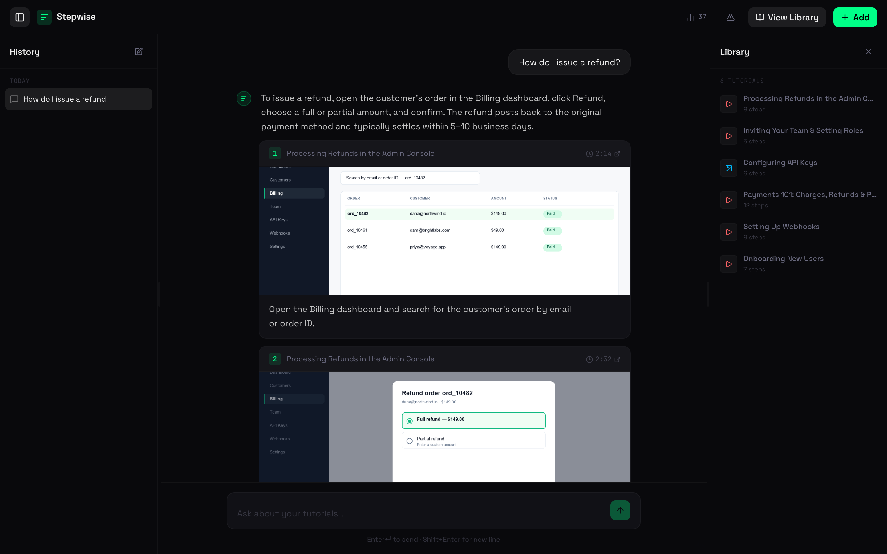
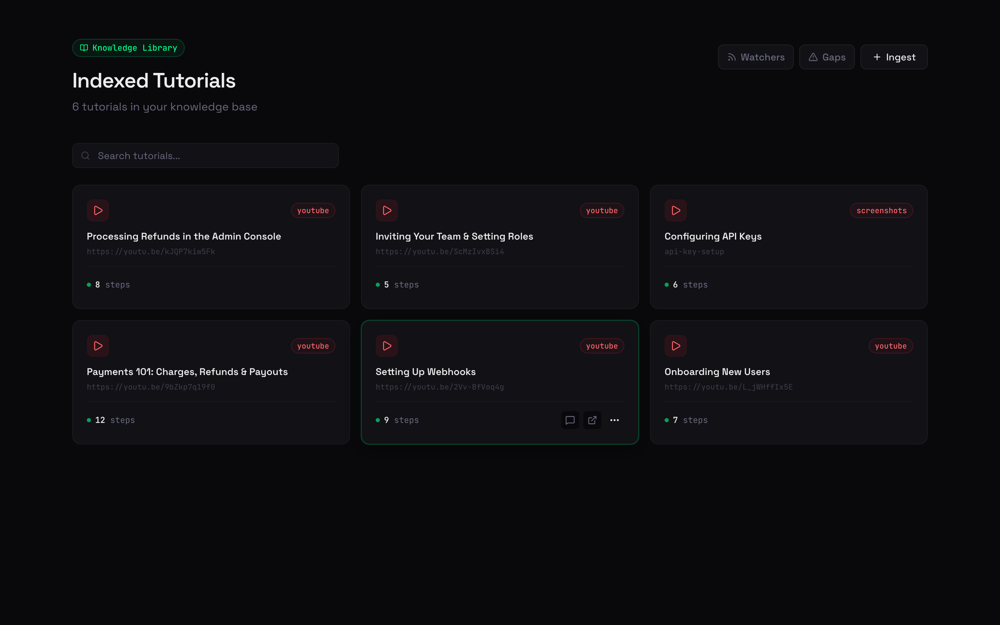
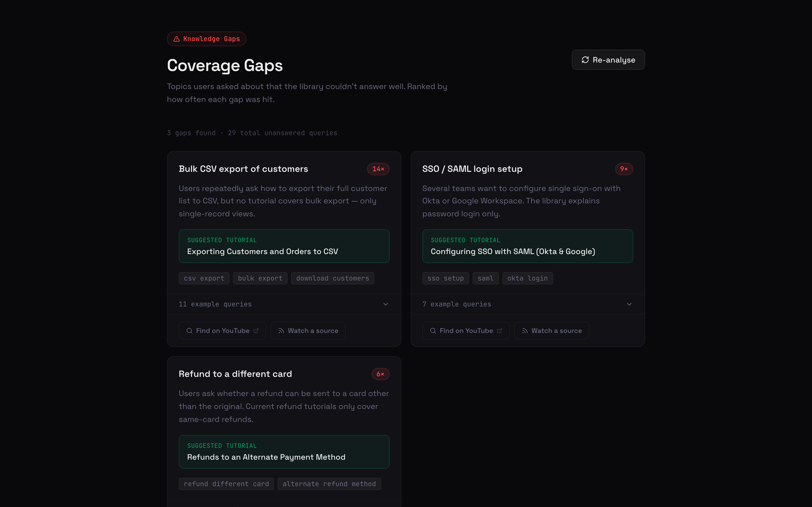
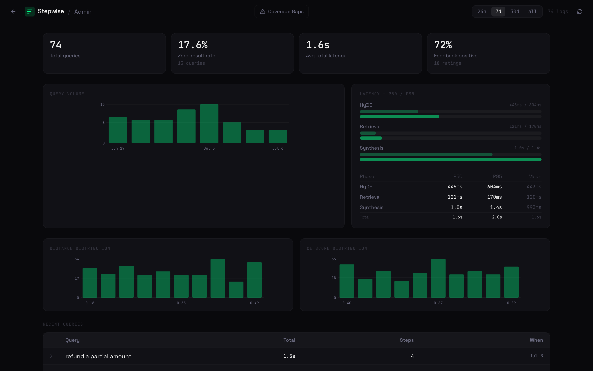

# Demo — what to try first

Stepwise turns tutorial videos and screenshots into a knowledge base that answers
questions with the **exact step** — and the **screenshot to prove it**. Here's the
30-second tour, in the order worth clicking.

> The screenshots below are the real UI running against a small sample library
> (a handful of support tutorials). Point it at your own videos and the same
> views fill in with your content.

---

## 1. Ask a question → get a cited, step-by-step answer

Open the app and ask something in plain English, e.g. **"How do I issue a refund?"**
Stepwise retrieves the most relevant steps, synthesises a short answer on top, and
shows each supporting step as a card with the **video frame** and a **timestamp that
deep-links back to the exact moment** in the source.

**Try:** click a timestamp (e.g. `2:14`) to jump straight to that point in the video,
or use 👍 / 👎 on a step — that feedback feeds the analytics and gap detection below.

---

## 2. Browse the library

Every ingested source is decomposed into structured steps. The **Library** lists what's
indexed, the source type (YouTube / Drive / Notion / screenshots), and step counts. Use
the search box to filter, or scope a question to a single tutorial from the sidebar.

**Try:** click **+ Add** on the main screen to ingest a YouTube URL or a set of
screenshots and watch it appear here once processing finishes.

---

## 3. Find coverage gaps

Stepwise clusters the questions your library *couldn't* answer well, names each gap with
Claude, and suggests exactly what tutorial to record next — with search terms and one-click
links to go find or watch a source.

---

## 4. Peek at the analytics (optional)

The **Admin** dashboard shows query volume, retrieval quality (distance / cross-encoder
score distributions), per-phase latency (HyDE → retrieval → synthesis), and thumbs
feedback — everything you need to tell whether retrieval is actually working.

---

## Run it yourself

See the [main README](../README.md) for setup. In short: start the FastAPI backend, then
the Next.js frontend in [`web/`](../web), ingest a tutorial with **+ Add**, and ask away.
